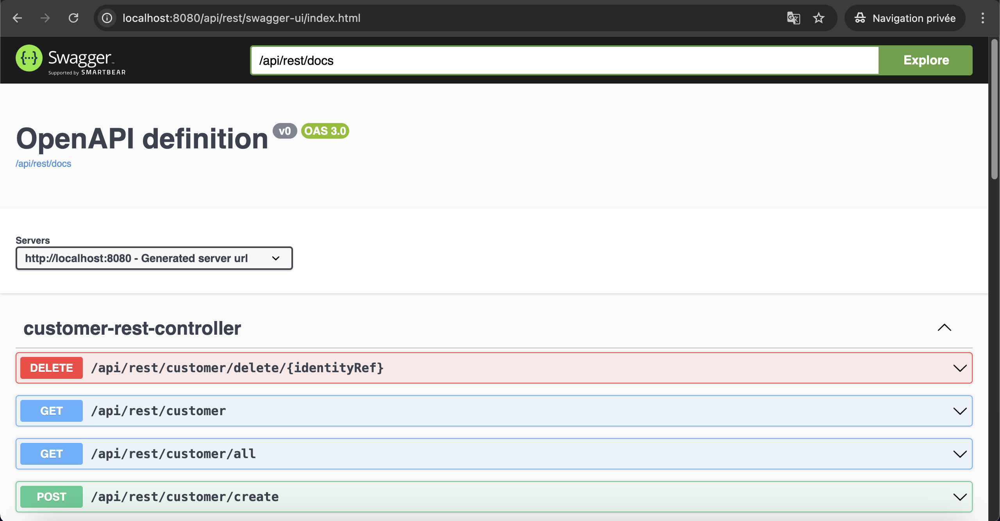
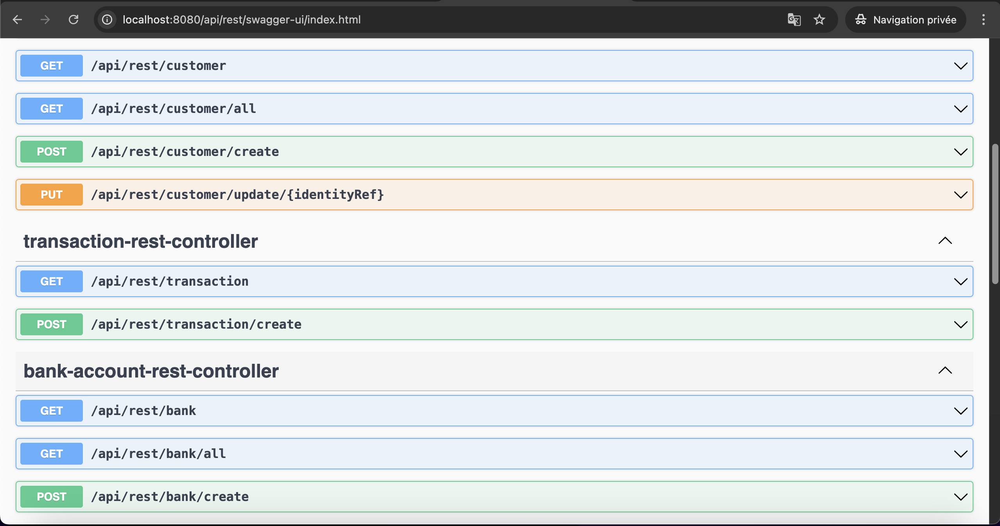
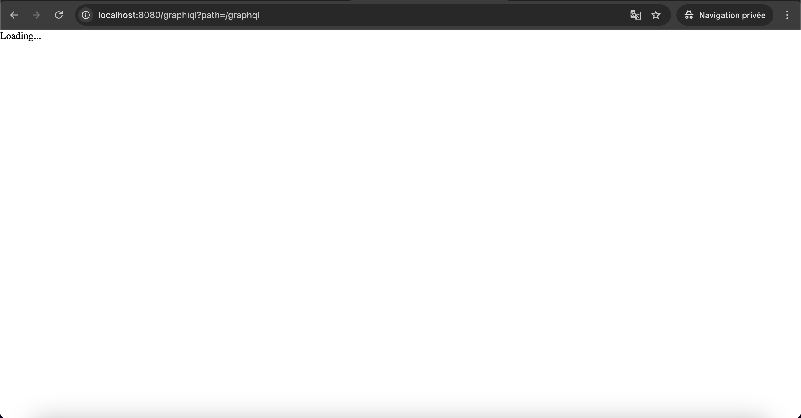
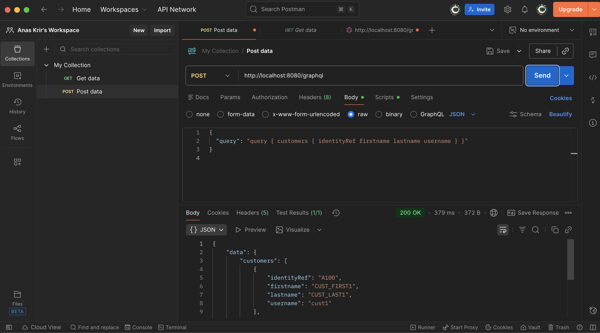
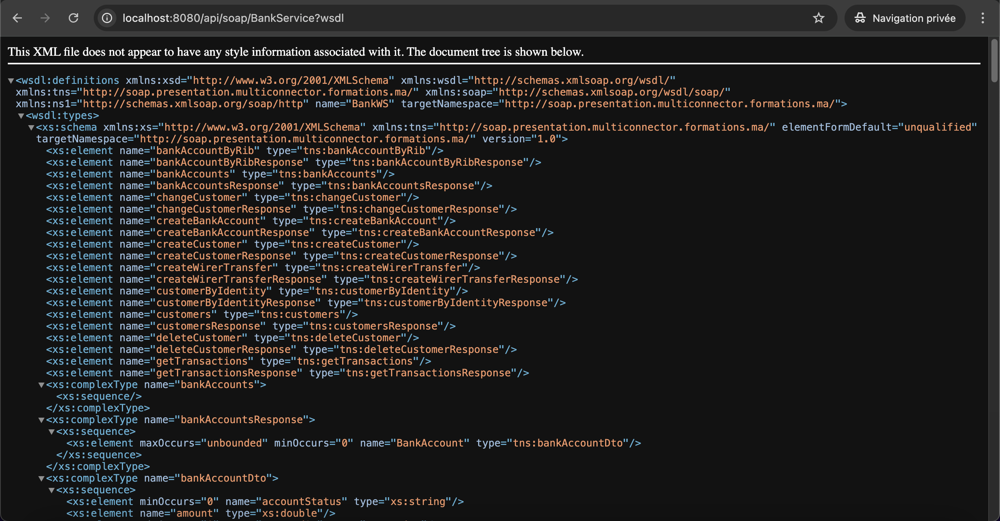
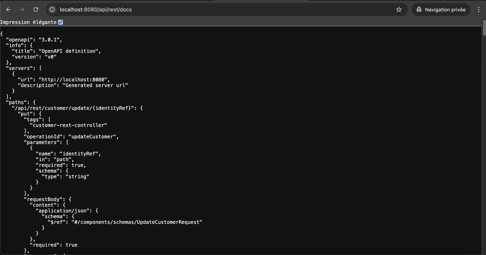
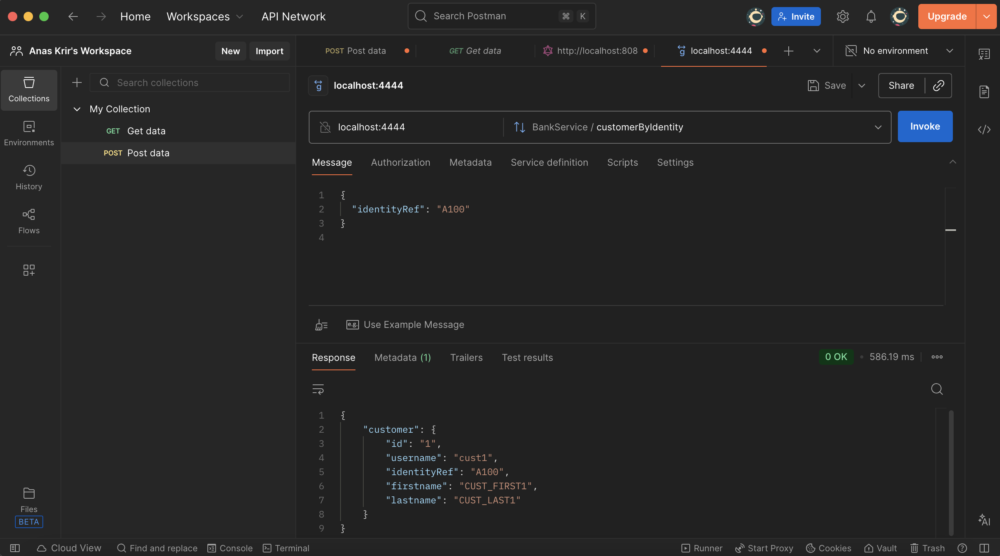

# TP 7 — Web Service Multi-Connecteur (REST, GraphQL, SOAP & gRPC)


Projet du **TP 7 – Web Service Multi-Connecteur**.  
Ce TP a pour objectif de **concevoir un même service métier exposé via plusieurs technologies de communication**, en utilisant **Spring Boot**.

Les connecteurs implémentés sont :
- **REST**
- **GraphQL**
- **SOAP**
- **gRPC**

---

## 📌 Sommaire

1. [Objectifs du TP](#-objectifs-du-tp)
2. [Concepts clés](#-concepts-clés)
3. [Stack technique](#-stack-technique)
4. [Architecture du projet](#-architecture-du-projet)
5. [Services exposés](#-services-exposés)
6. [Démarrage rapide](#-démarrage-rapide)
7. [Tests & démonstrations](#-tests--démonstrations)
8. [Remarques importantes](#-remarques-importantes)
9. [Auteurs](#-auteurs)
10. [Licence](#-licence)

---

## 🎯 Objectifs du TP

- Comprendre le principe des **Web Services**
- Implémenter une **architecture multi-connecteur**
- Exposer un même service métier via :
    - REST (HTTP / JSON)
    - GraphQL
    - SOAP (WSDL)
    - gRPC (HTTP/2 + Protocol Buffers)
- Tester chaque connecteur avec des outils adaptés
- Comparer les différents styles de communication

---

## 🧠 Concepts clés

### 🔹 REST
- Basé sur HTTP
- Représentation JSON
- Documentation via **OpenAPI / Swagger**

### 🔹 GraphQL
- Un seul endpoint `/graphql`
- Requêtes flexibles
- Récupération ciblée des données

### 🔹 SOAP
- Basé sur XML
- Contrat formel via **WSDL**
- Très utilisé dans les systèmes bancaires et legacy

### 🔹 gRPC
- RPC moderne basé sur **HTTP/2**
- Sérialisation binaire (**Protocol Buffers**)
- Très performant
- Non accessible via navigateur

---

## 🛠️ Stack technique

| Technologie | Version |
|------------|---------|
| Java | 17 |
| Spring Boot | 3.x |
| REST | Spring Web |
| GraphQL | Spring GraphQL |
| SOAP | Spring WS |
| gRPC | grpc-spring-boot-starter |
| Protocol Buffers | 3.x |
| Maven | ✅ |
| IntelliJ IDEA | Ultimate |
| OS | macOS |

---

## 🏗️ Architecture du projet

```
bank-service-multi-connector/
├── src/main/java/ma/formations/multiconnector/
│ ├── config/
│ ├── dao/
│ ├── domain/
│ ├── dtos/
│ ├── service/
│ ├── presentation/
│ │ ├── rest/
│ │ ├── graphql/
│ │ ├── soap/
│ │ └── grpc/
│ └── BankServiceMultiConnectorApplication.java
│
├── src/main/resources/
│ ├── application.properties
│ ├── bank.proto
│ └── graphql/
│
├── pom.xml
└── README.md
```


---

## 🧩 Services exposés

### 🟦 REST
- Gestion des clients
- Gestion des comptes bancaires
- Gestion des transactions

### 🟪 GraphQL
- Query `customers`
- Query `customerByIdentity`
- Mutations de création et modification

### 🟧 SOAP
- Service `BankService`
- WSDL généré automatiquement
- Méthodes : customers, createCustomer, createBankAccount, transactions…

### 🟩 gRPC
- Service `BankService`
- Méthodes unary :
    - customers
    - customerByIdentity
    - bankAccounts
    - addBankAccount
    - addWirerTransfer
    - getTransactions

---

## 🚀 Démarrage rapide

### 1️⃣ Prérequis

✅ Java 17  <br/>
✅ Maven   <br/>
✅ IntelliJ IDEA (Ultimate)   <br/>
✅ Git <br/>

### 2️⃣ Cloner le projet

```
git clone https://github.com/AnasKrir/TP7-bank-service-multi-connector.git
cd bank-service-multi-connector
```

### 3️⃣ Générer les stubs gRPC
```
mvn clean install
```

### 4️⃣ Lancer l’application

**_Depuis IntelliJ IDEA :_** <br/>

```
BankServiceMultiConnectorApplication.java
```

**_Ports utilisés :_**

- REST / GraphQL / SOAP : http://localhost:8080 <br/>
- gRPC : localhost:4444 <br/>

---


## 🔗 Tests & démonstrations

### 🔹 REST — Swagger UI

- URL : <br/>

#### 👉🏻 http://localhost:8080/api/rest/swagger-ui/index.html

| Swagger REST      |
|-------------------|
|    |
|    |
|  |


### 🔹 GraphQL — Test via Postman

- Endpoint : <br/>

#### 👉🏻 POST http://localhost:8080/graphql <br/>

- Query : <br/>
```
{
"query": "query { customers { identityRef firstname lastname username } }"
}
```

| GraphQL Test      |
| ----------------- |
|    |
|  |

### 🔹 SOAP — WSDL <br/>

- URL : <br/>

#### 👉🏻 http://localhost:8080/api/soap/BankService?wsdl <br/>

| SOAP WSDL       |
|-----------------|
|  |


### 🔹 gRPC — Test via Postman gRPC

- Host : localhost  <br/>
- Port : 4444  <br/>
- Proto : bank.proto  <br/>
- Service : BankService <br/>
```
{
"identityRef": "A100"
}
```

| gRPC Test       |
| --------------- |
|  |
|  |

#### ⚠️ Le port gRPC n’est pas accessible via navigateur (comportement normal). <br/>

---

## ⚠️ Remarques importantes <br/>

- Le même service métier est exposé via 4 technologies différentes <br/>
- gRPC utilise HTTP/2 + Protobuf <br/>
- SOAP repose sur un contrat WSDL <br/>
- GraphQL fonctionne via un endpoint unique <br/>
- REST est documenté via Swagger / OpenAPI <br/>

---

## 👥 Auteurs

Anas KRIR & Adam EL YOURI <br/>
Étudiants Ingénieurs — MIAGE <br/>
TP réalisé dans le cadre du module ARCHITECTURE DES COMPOSANTS D'ENTREPRISES <br/>

Technologies : <br/>
Java · Spring Boot · REST · GraphQL · SOAP · gRPC · Protocol Buffers · Maven <br/>

---

## 📄 Licence

✅ Projet sous licence MIT <br/>
Libre d’utilisation, modification et distribution à des fins pédagogiques. <br/>

© 2025 — Anas KRIR & Adam EL YOURI <br/>

---

